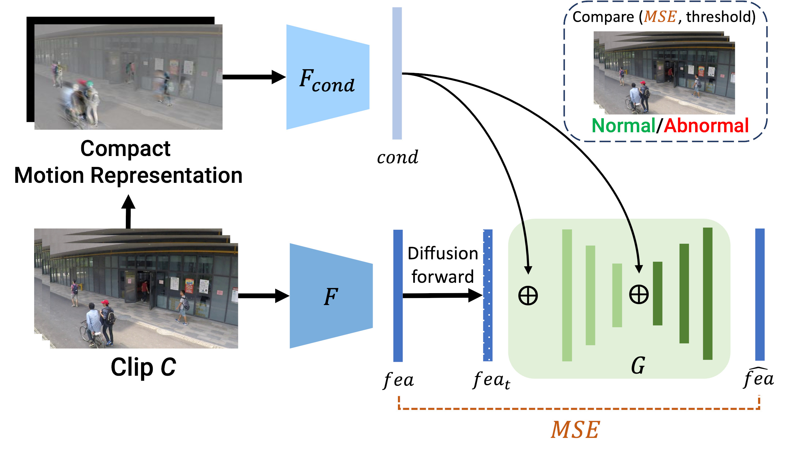

# [ICIAP 2023] Unsupervised Video Anomaly Detection with Diffusion Models Conditioned on Compact Motion Representations




> [**Unsupervised Video Anomaly Detection with Diffusion Models Conditioned on Compact Motion Representations**](https://doi.org/10.1007/978-3-031-43153-1_5)<br>
> [Anil Osman Tur](https://scholar.google.com/citations?user=W4yNf8UAAAAJ), [Nicola Dall'Asen](https://scholar.google.com/citations?user=e7lgiYYAAAAJ), [Cigdem Beyan](https://scholar.google.com/citations?user=VmjUxckAAAAJ), [Elisa Ricci](https://scholar.google.com/citations?user=xf1T870AAAAJ)<br>
> University of Trento, Fondazione Bruno Kessler, Trento, Italy, <br>


## Installation

Please follow the instructions in [INSTALL.md](docs/INSTALL.md).

## Dataset and Data Preparation

Please follow the instructions in [DATASET.md](docs/DATASET.md) for data preparation.


## Diffusion Model

Implemented diffusion models are in the k_diffusion/models folder. The models are trained with train_ano*.py scripts.


## Autoencoder Model

The autoencoder model is re-implemented from the descriptions of the paper [Generative Cooperative Learning for Unsupervised Video Anomaly Detection](https://openaccess.thecvf.com/content/CVPR2022/html/Zaheer_Generative_Cooperative_Learning_for_Unsupervised_Video_Anomaly_Detection_CVPR_2022_paper.html). Used for generating the baselines for the paper. Our implementation of it can be in [here](https://github.com/AnilOsmanTur/video_anomaly_diffusion).


 


## Citation:

Please use the following BibTeX entry for citation.

```latex

@InProceedings{tur2023unsupervised,
author="Tur, Anil Osman and Dall'Asen, Nicola and Beyan, Cigdem and Ricci, Elisa",
editor="Foresti, Gian Luca and Fusiello, Andrea and Hancock, Edwin",
title="Unsupervised Video Anomaly Detection with Diffusion Models Conditioned on Compact Motion Representations",
booktitle="Image Analysis and Processing -- ICIAP 2023",
year="2023",
publisher="Springer Nature Switzerland",
address="Cham",
pages="49--62",
isbn="978-3-031-43153-1"
}

```
